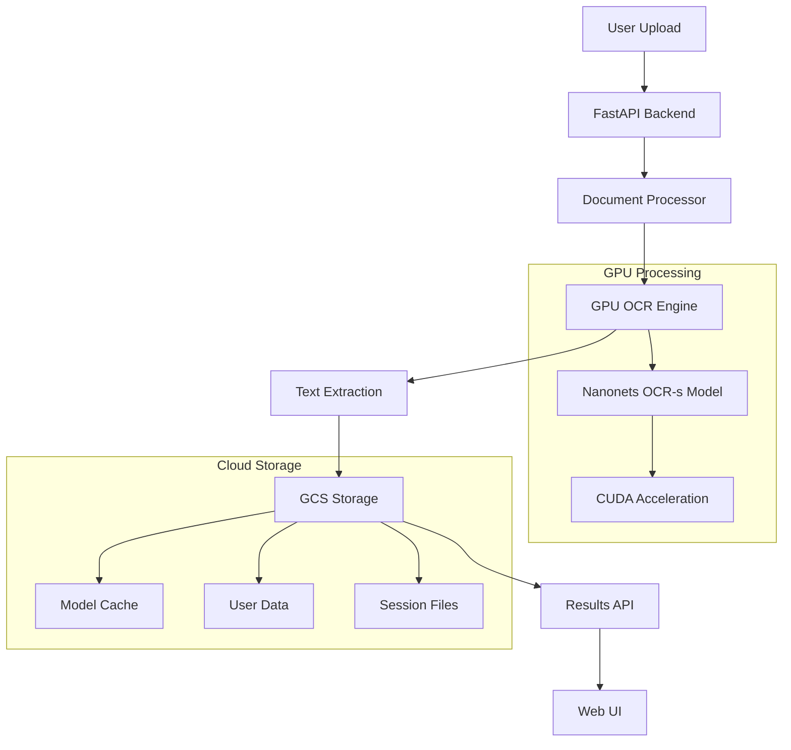

# 🔍 Gnosis OCR

<div align="center">

**Enterprise-Grade GPU-Accelerated OCR Service**

*Extract text from documents with state-of-the-art AI models*

[](https://opensource.org/licenses/MIT)
[](https://www.docker.com/)
[](https://developer.nvidia.com/cuda-zone)
[](https://cloud.google.com/run)

[Quick Start](#-quick-start) • [Features](#-features) • [Documentation](#-documentation) • [Deployment](#-deployment) • [API](#-api-reference)

</div>

## ✨ Features

- 🚀 **GPU-Accelerated Processing** - Powered by NVIDIA CUDA for blazing-fast OCR
- 🎯 **State-of-the-Art Models** - Uses Nanonets OCR-s for superior accuracy
- 📄 **Large File Support** - Process up to 500MB PDFs with HTTP/2 streaming (uploads work during model loading)
- ⚡ **Live Results Preview** - See extracted text in real-time as pages complete
- 🔄 **Incremental Processing** - No waiting - results appear as they're ready
- ☁️ **Cloud Native** - Deploy to Google Cloud Run with auto-scaling
- 🔒 **Enterprise Security** - User isolation, session management, and audit trails
- 📊 **Real-Time Progress** - Live processing updates and detailed analytics
- 🌐 **Modern Web UI** - Beautiful, responsive interface with dark mode
- 🔌 **REST API** - Full programmatic access with OpenAPI docs


## 🚀 Quick Start

### Prerequisites

- **NVIDIA GPU** with 12GB+ VRAM (RTX 3060 12GB/3070/3080/3090 or better)

- **Docker Desktop** with GPU support
- **16GB+ RAM** (32GB recommended for large documents)


### Local Development

```bash
# Clone the repository
git clone https://github.com/kordless/gnosis-ocr.git
cd gnosis-ocr

# Create environment files
cp .env.cloudrun.example .env.cloudrun
# Edit PROJECT_ID if deploying to cloud
cp .env.example .env

# Build and run with GPU support
docker-compose up --build
```

🎉 **That's it!** Visit http://localhost:7799 to start processing documents.

### Cloud Deployment

Deploy to Google Cloud Run with NVIDIA L4 GPU:

```powershell
# One-command deployment
./scripts/deploy.ps1 -Target cloudrun
```

See [Deployment Guide](docs/UNIFIED_DEPLOYMENT.md) for detailed instructions.

## 📸 Screenshots

<div align="center">

### Document Upload


### Live Results Preview


### OCR Results


</div>

## 🏗️ Architecture



## 🎯 Performance

| Metric | Local (RTX 3090) | Cloud Run (L4) | 
|--------|-------------------|--------------------
| **Model Startup** | ~4 minutes | ~30 seconds |
| **Processing Speed** | ~20 sec/page | ~5-10 sec/page |
| **Live Preview** | ✅ Real-time | ✅ Real-time |
| **Max File Size** | 500MB | 500MB |
| **Concurrent Users** | 1-2 | 10+ |
| **Model Loading** | Cached | Persistent Mount |


## 🔧 Configuration

### Environment Variables

| Variable | Description | Default |
|----------|-------------|---------|
| `DEVICE` | Processing device | `cuda` |
| `MODEL_NAME` | OCR model to use | `nanonets/Nanonets-OCR-s` |
| `MAX_FILE_SIZE` | Maximum upload size | `500MB` |
| `SESSION_TIMEOUT` | Session duration | `3600` seconds |
| `LOG_LEVEL` | Logging verbosity | `INFO` |


### GPU Requirements

- **Minimum**: 12GB VRAM (RTX 3060 12GB, RTX 3070)
- **Recommended**: 12GB+ VRAM (RTX 3080/3090/4070 Ti/4080/4090)
- **Cloud**: NVIDIA L4 (24GB VRAM)


## 📖 Documentation

- 📚 [Deployment Guide](docs/UNIFIED_DEPLOYMENT.md) - Complete deployment instructions
- 🔧 [Setup Guide](docs/SETUP_DEPLOYMENT.md) - Development environment setup
- 🌐 [API Reference](http://localhost:7799/docs) - Interactive OpenAPI documentation
- 🐳 [Docker Guide](docs/DOCKER.md) - Container configuration and troubleshooting

## 🚀 Deployment

### Local Development
```bash
docker-compose up --build
```

### Local Dev Environment
```powershell
./scripts/deploy.ps1 -Target local
```

### Production (Cloud Run)
```powershell
./scripts/deploy.ps1 -Target cloudrun
```

### Cloud Build (CI/CD)
```bash
gcloud builds submit --config cloudbuild.yaml
```

## 📡 API Reference

### Upload Document
```bash
curl -X POST "http://localhost:7799/api/v1/jobs/submit" \
  -H "Content-Type: multipart/form-data" \
  -F "file=@document.pdf"
```

### Check Status (with Live Results)
```bash
curl "http://localhost:7799/api/v1/jobs/{job_id}/status"
# Returns incremental results in partial_results array
```

### Get Final Results
```bash
curl "http://localhost:7799/api/v1/jobs/{job_id}/result"
```

### Example Status Response
```json
{
  "status": "processing",
  "progress": {
    "current_page": 3,
    "total_pages": 10,
    "percent": 30
  },
  "partial_results": [
    {
      "page_number": 1,
      "text": "# Document Title\nExtracted content...",
      "status": "completed",
      "confidence": 0.95
    },
    {
      "page_number": 2,
      "text": "Page 2 content...",
      "status": "completed",
      "confidence": 0.93
    }
  ]
}
```


Complete API documentation available at `/docs` endpoint.

## 🏢 Enterprise Features

- **Live Results Streaming** - Real-time text extraction as pages complete
- **Incremental Processing** - No waiting for entire documents to finish
- **Multi-Tenant Architecture** - User isolation and data partitioning
- **Audit Logging** - Complete request/response tracking
- **Auto-Scaling** - Handles traffic spikes automatically
- **Health Monitoring** - Built-in health checks and metrics
- **Security** - CORS, rate limiting, and input validation
- **Storage Integration** - Google Cloud Storage with lifecycle management


## 🤝 Contributing

We welcome contributions! Please see our [Contributing Guide](CONTRIBUTING.md) for details.

1. Fork the repository
2. Create a feature branch (`git checkout -b feature/amazing-feature`)
3. Commit changes (`git commit -m 'Add amazing feature'`)
4. Push to branch (`git push origin feature/amazing-feature`)
5. Open a Pull Request

## 📄 License

This project is licensed under the MIT License - see the [LICENSE](LICENSE) file for details.

## 🙏 Acknowledgments

- **Nanonets** - For the excellent OCR model
- **HuggingFace** - For the transformers library
- **FastAPI** - For the robust web framework
- **NVIDIA** - For CUDA and GPU acceleration

## 📊 Analytics

<div align="center">


</div>

---

<div align="center">

**⭐ Star this repository if you find it useful! ⭐**

[Report Bug](https://github.com/kordless/gnosis-ocr/issues) • [Request Feature](https://github.com/kordless/gnosis-ocr/issues) • [Join Discord](https://discord.gg/gnosis-ocr)

</div>
